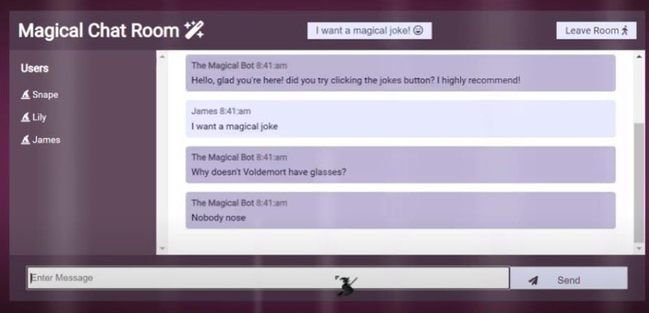
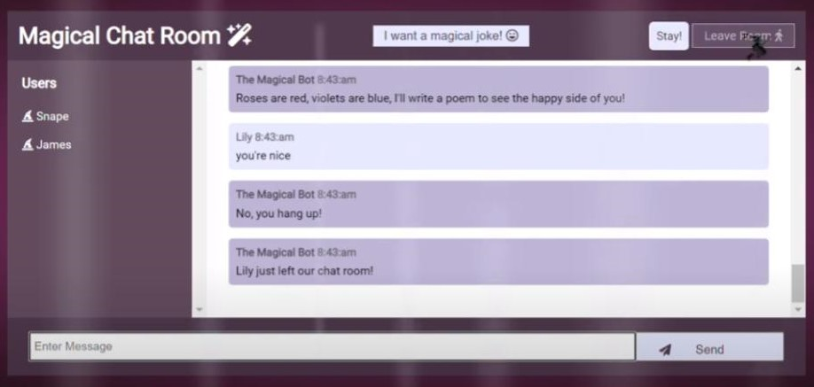

# ✨ The Magical Chat Room ✨

Hello, wizard!

Welcome to the magical chat room!
This chat room is designed to let you interact with other users, so anyone can ask and respond to each other's questions.

To run the app, check out the instructions in the README files of the server and the client.

A connection to Mongo is required in order for the application to save answers to previously asked questions, and for the Magical Chat Bot to answer such repeating questions.

Wishing you an enchanting experience!

---

# Technologies 👩‍💻

* Languages: NodeJS, HTML, CSS
* Framework: Lit (web-components)
* Protocol: WebSocket
* Database: MongoDB
---

# Requirements / Considerations 📝
* A chat application where each user can post questions & answers to in a chat room
* Featured user - a chat-bot that can answer questions that have been previously answered in this chat-room
    * Met by MongoDB integration. Answers for previously asked questions are stored in the DB. Asnwers are saved only if submitted by a user that is different than the one asking the question.
* Full synchronization between all users in the chat-room
    * Met by using WebSocket protocol
* Chat bot with an attitude: a bot that can make the users laugh.
    * The bot has a "magical" attitude, with references to Harry Potter
---
# Pictures 📷

# Video 🎬

## click the button to strat the video 

